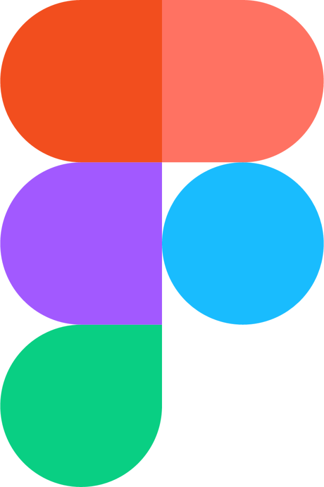

<h1 align="center">I'm Din Muhammad</h1>
<h3 align="center">A frontend developer || Teacher</h3>

## 👤 About Me

 I am a dedicated web developer, passionate about continuous learning and staying updated with the latest industry trends. Graduated from Khulna University with a strong foundation in computer science, I have extensive skills in web development using various technologies.

My expertise includes:
- Front-end development with HTML, CSS, JavaScript, and React.  
- Back-end development using Node.js and Express.  
- Proficient in database management with MySQL and MongoDB.  
- Experienced in Git for version control.  
- I have successfully developed and maintained multiple websites and web applications, emphasizing user experience and performance optimization. Notable projects include a fully functional <b> Medical Camp management </b> platform built with React and Node.js, a dynamic blog platform using Django, and a personal portfolio website.
- I excel in problem-solving, attention to detail, and teamwork, contributing effectively to collaborative projects. My goal is to leverage my skills and passion for creating impactful web solutions. 

  
- [📄 Resume](https://drive.google.com/file/d/1QsWlcpjyYNYhcjH15w5cJNHND3VJdbC3/view?usp=sharing)
- [🌐 portfolio](https://jewel-190237.github.io/personal-site/)
- ✉️ 190237@ku.ac.bd

## :speech_balloon: Connect with me

## :computer: Technologies I am proficient in

<h3 align="center">Programming Languages</h3>

  
  
  
  

<h3 align="center" >Web Application</h3>

  
  
  
  
  
  
  
  

<h3 align="center" >Others tools</h3>

  
  
  

## :chart_with_upwards_trend: Current Stats

 

  

  

