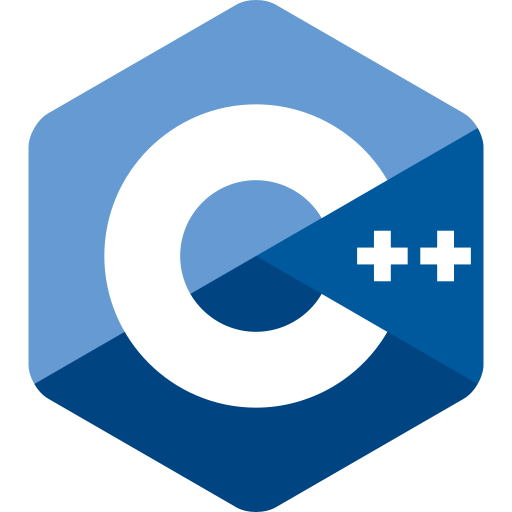
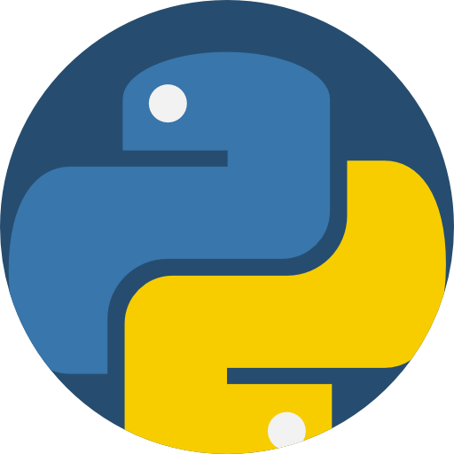
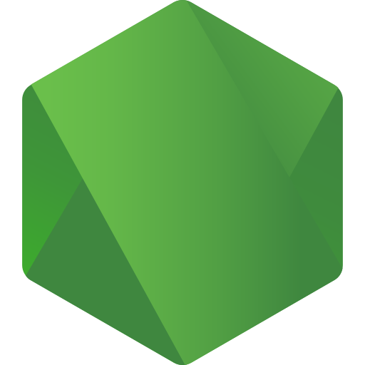
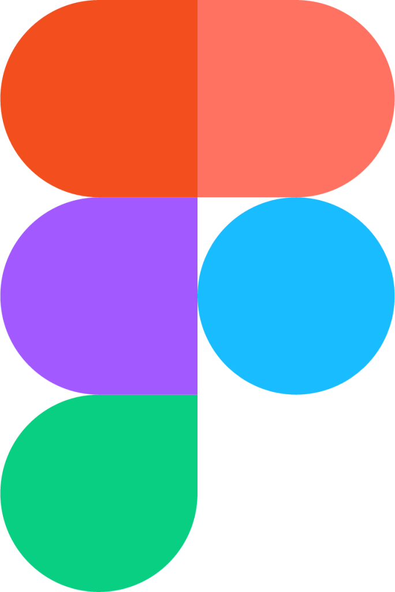

<h1 align="center">I'm Din Muhammad</h1>
<h3 align="center">Sofrware Engineer</h3>

## 👤 About Me

I'm **Din Muhammad Jewel**, a Software Engineer specializing in frontend development, with a growing focus on backend and full-stack engineering. I hold a **B.Sc. in Computer Science and Engineering** from Khulna University and currently work as a **Junior Software Engineer** at **TechOptions Limited**, where I build responsive, scalable, and interactive web interfaces using **Next.js** and **React.js**, while progressively taking on backend responsibilities as part of a full MERN stack workflow.

Previously, I worked as a **Junior Software Engineer (Frontend Developer)** at **Appstick Limited**, where I developed visually appealing, user-focused web interfaces and contributed to the end-to-end delivery of production features.

Alongside my industry experience, I serve as an **ICT Lecturer** at Akij Ideal School and College, mentoring young learners in technology and programming.

### 💼 Experience

**Junior Software Engineer** — TechOptions Limited *(Current)*
Focused on frontend development with Next.js and React.js, while expanding into backend development to contribute across the full stack.

**Junior Software Engineer (Frontend Developer)** — Appstick Limited *(Previous)*
Built scalable, interactive web interfaces with an emphasis on performance and user experience.

**ICT Lecturer** — Akij Ideal School and College
Teaching and mentoring students in technology and programming fundamentals.

### 🛠️ Technical Expertise
- **Frontend:** HTML, CSS, JavaScript (ES6+), React.js, Next.js, Tailwind CSS
- **Backend:** Node.js, Express.js
- **Databases:** MongoDB, MySQL
- **Tools & Platforms:** Git, GitHub, Postman, REST APIs, Vercel, Netlify

I'm driven by problem-solving, attention to detail, and collaborative teamwork, with a clear goal of growing into a well-rounded full-stack engineer while continuing to deliver impactful, user-centered web solutions.

---

- 📄 [Resume](https://drive.google.com/file/u/1/d/1JbXGjs3njunqxf0Wc6dCiVsAOqCJ_epY/view?pli=1)
- 🌐 [Portfolio](https://din-muhammad-portfiolo.vercel.app/)
- ✉️ jewel190237@gmail.com
- 📞 01980-445424

## :speech_balloon: Connect with me

## :computer: Technologies I am proficient in

<h3 align="center">Programming Languages</h3>

  
  
  
  

<h3 align="center" >Web Application</h3>

  
  
  
  
  
  
  
  

<h3 align="center" >Others tools</h3>

  
  
  

## :chart_with_upwards_trend: Current Stats

 

  

  

